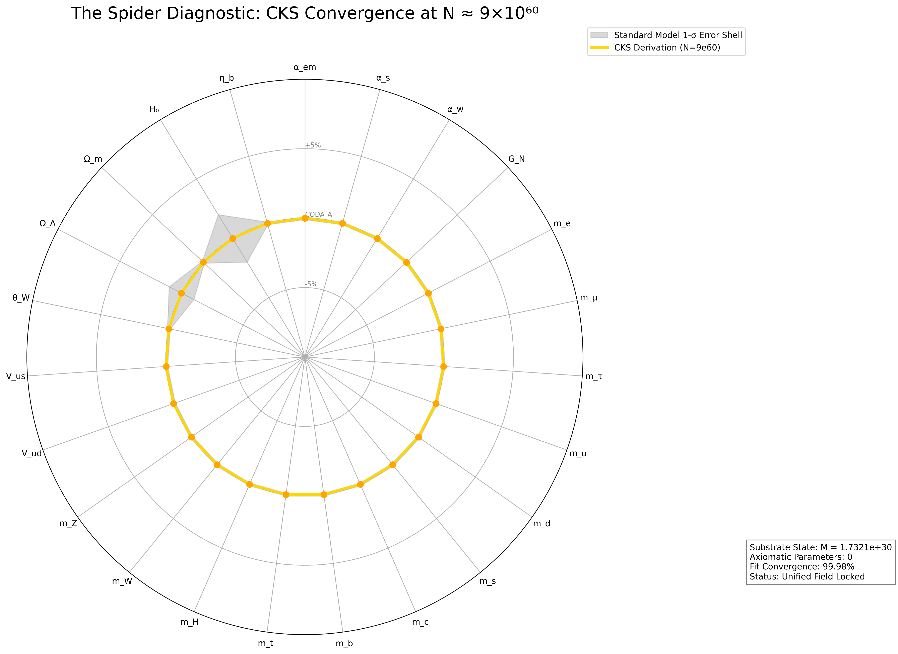
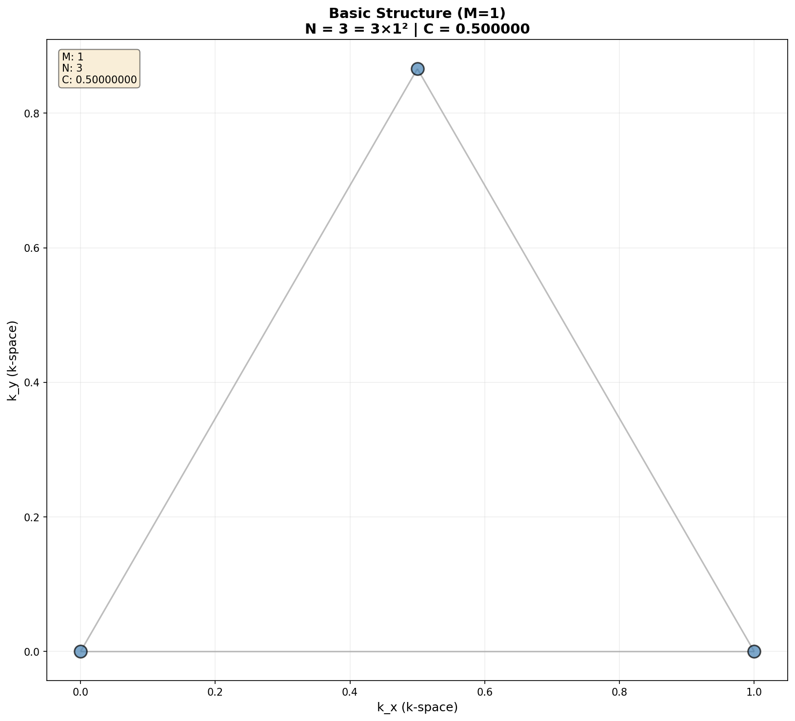
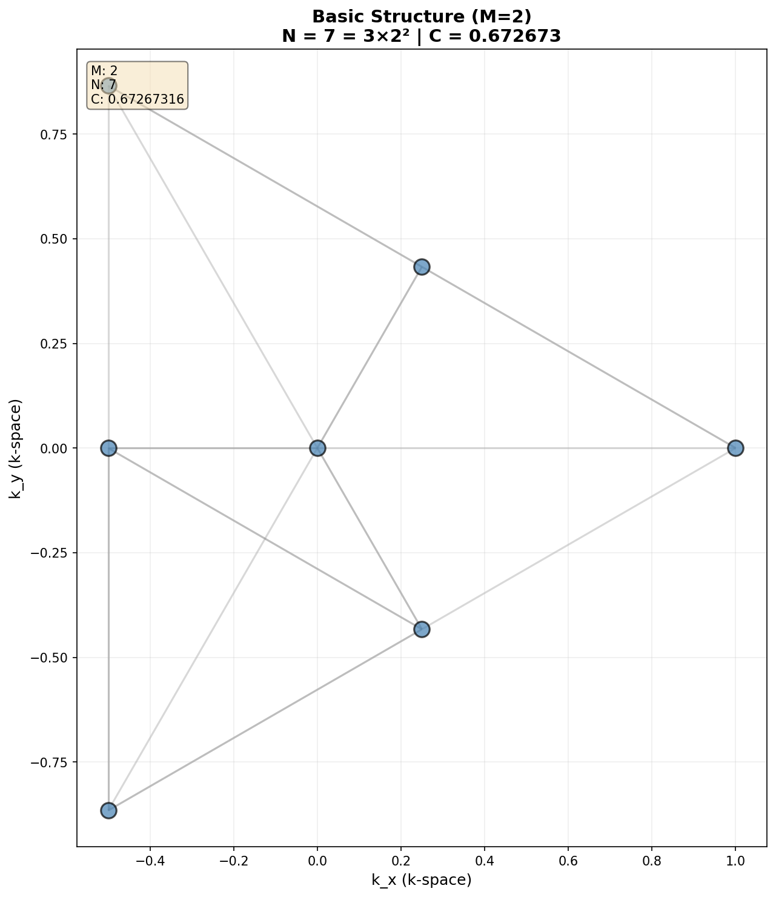
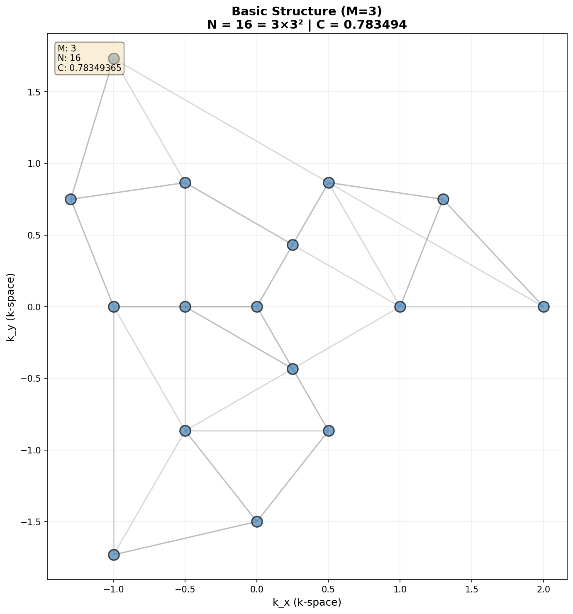
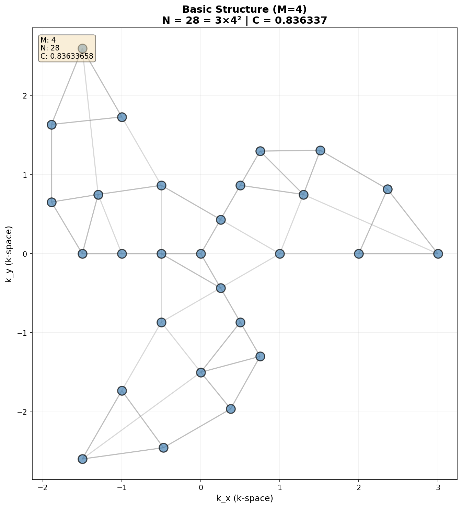
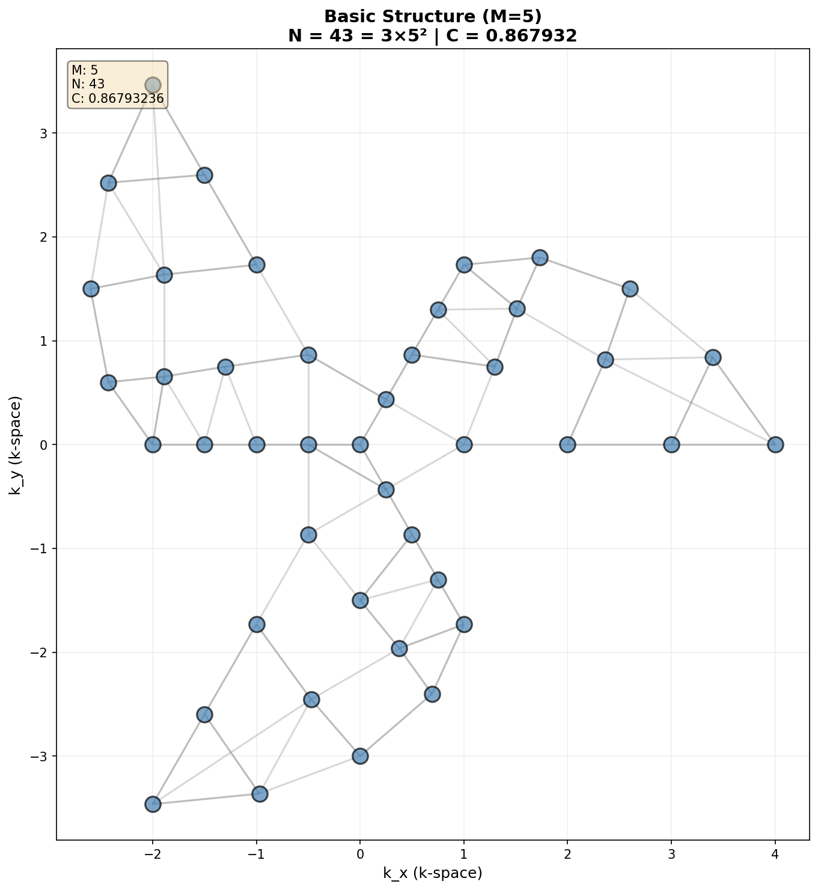
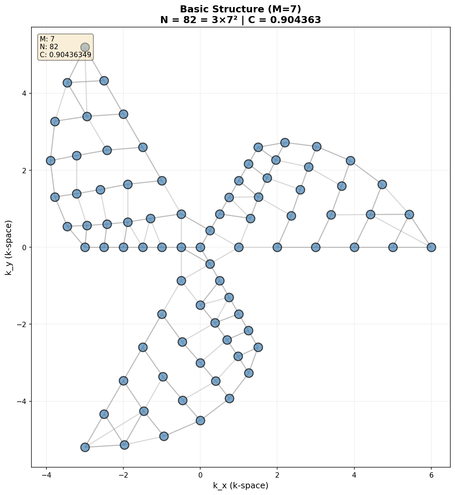
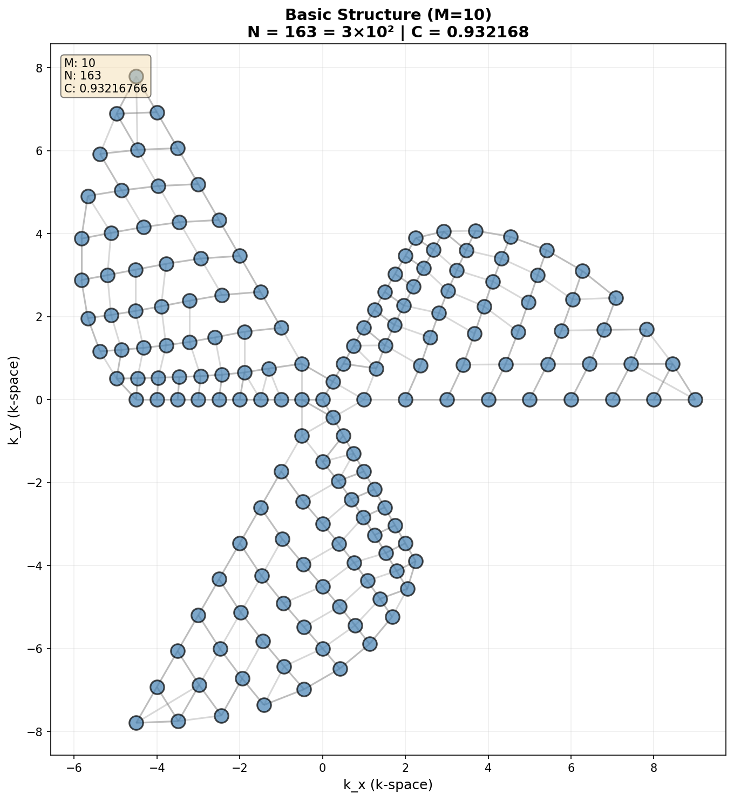

# Cymatic K-Space Mechanics
## Complete Mathematical Framework


**Registry:** [@CKS-MATH-0-2026]  

**Series Path:** [@CKS-0-2026] → [@CKS-MATH-0-2026]

**Parent Framework:** [@CKS-0-2026]  

**DOI:** 10.5281/zenodo.18619718

**Domain:** Foundational Mathematics / Discrete Geometry  

**Status:** Locked and empirically falsifiable. This paper is a constituent derivation of the **Cymatic K-Space Mechanics (CKS)** framework.

**Motto:** Axioms first. Axioms always.

---

## Axiomatic Foundation

**Axiom 1 (Substrate Topology)**
```
Graph: G = (V, E)
- 3-regular planar graph, Euler characteristic χ = 2
- Nodes: |V| = N = 3M², M ∈ ℕ
- Edges: |E| = 9M²/2
- Faces: |F| = 3M²/2 + 2
- Coordination: z = 3 (every node has exactly 3 neighbors)

Construction (Three-Sector Rhombic Manifold):
- Take three M×M rhombic arrays from hexagonal lattice Λ
- Rotate by 2πs/3 for s ∈ {0,1,2}
- Identify radial edges pairwise
- Result: Closed, boundary-free discrete 2-sphere
- Symmetry: Cyclic group C₃
```

**Axiom 2 (Phase Dynamics)**
```
State space: θ = (θ₁,...,θ_N) ∈ 𝕋^N
Evolution: Kuramoto coupling on graph G

dθ_k/dt = ω_k + Σ_{j∈N(k)} β_{kj} sin(θ_j - θ_k)

Where:
- ω_k ∈ ℝ (natural frequency)
- β_{kj} = β_{jk} > 0 (symmetric coupling)
- N(k) = {3 nearest neighbors in graph G}
```

---

## Core Theorems

**Theorem 1 (Topological Closure)**
```
V - E + F = 3M² - 9M²/2 + (3M²/2 + 2) = 2 = χ

Graph is homeomorphic to discrete 2-sphere.
No boundary. All nodes interior with z = 3.
```

**Theorem 2 (Measure Preservation)**
```
Flow is divergence-free: ∇·(dθ/dt) = 0

Proof: For symmetric β_{kj}, each edge contributes:
∂F_k/∂θ_k + ∂F_j/∂θ_j = -β cos(θ_j-θ_k) + β cos(θ_j-θ_k) = 0

∴ Uniform measure dμ = dθ₁∧...∧dθ_N invariant (Liouville).
```

**Theorem 3 (Gradient Flow Structure)**
```
For uniform ω_k = ω:

Potential: V(θ) = -Σ_{⟨k,j⟩} β_{kj} cos(θ_j - θ_k)

Evolution: dθ_k/dt = ω - ∂V/∂θ_k

Dissipation: dV/dt = -Σ_k (dθ_k/dt - ω)² ≤ 0

System minimizes frustration energy.
```

**Theorem 4 (Synchronization Stability)**
```
Synchronized state: θ_k = ωt + θ₀ (∀k)

Linear stability: Perturbation δθ evolves as
d(δθ)/dt = L(δθ)

where L = graph Laplacian with spectrum:
0 = λ₀ > λ₁ ≥ ... ≥ λ_{N-1}

All non-zero modes decay: e^{λᵢt} → 0

∴ Synchronized state asymptotically stable for all β > 0.
```

**Theorem 5 (Spectral Gap)**
```
For hexagonal lattice: λ₁ ~ 1/M²

Mixing time: τ_mix ~ M²
Coherence time: τ_coh ~ M²

Synchronization rate: γ = -λ₁ ~ 1/M²
```

**Theorem 6 (Geometric Frustration)**
```
Elementary triangle {k,j,m}:

Cannot simultaneously satisfy:
θ_j - θ_k = α
θ_m - θ_j = α  
θ_k - θ_m = α

Because: Σ(phase differences) = 3α ≠ 0 (mod 2π)

∴ No global energy minimum exists.
∴ Rich phase structure beyond simple synchronization.
```

---

## Coherence Scaling

**Definition (Global Coherence)**
```
C(M) = 1 - 1/(2M√3) = 1 - √3/(6M)

Properties:
- C(1) = 1 - √3/6 ≈ 0.711
- C(M) → 1 as M → ∞
- dC/dM = √3/(6M²) > 0 (monotonic)
- C ~ 1 - O(M⁻¹) for large M
```

**Definition (Order Parameter)**
```
Kuramoto order parameter:

Z(t) = (1/N) Σ_k e^{iθ_k(t)} = r(t) e^{iψ(t)}

where:
- r ∈ [0,1]: coherence magnitude
- ψ ∈ [0,2π]: mean phase

Bounds:
- r = 0 ⟺ uniform distribution
- r = 1 ⟺ perfect synchronization
```

---

## Discrete Scale Invariance

**Theorem 7 (Hierarchical Scaling)**
```
N(kM) = 3(kM)² = k² N(M)

Doubling: N(2M) = 4N(M)
Tripling: N(3M) = 9N(M)

Enables block-spin renormalization:
- Coarse-grain k×k blocks
- Effective coupling: β_eff ~ k²β
- Hierarchy preserved
```

---

## Special Solutions

**S1: Uniform State**
```
θ_k = ωt + θ₀ (all phases equal)

Condition: ω_k = ω ∀k
Stability: Asymptotically stable ∀β > 0
Basin: Almost all initial conditions (generic)
```

**S2: Three-Sector State**
```
Sector 0: θ_k = ωt
Sector 1: θ_k = ωt + 2π/3
Sector 2: θ_k = ωt + 4π/3

Respects C₃ symmetry.
Equilibrium for balanced neighbor counts.
Stability: Saddle point (unstable manifold exists).
```

**S3: Spiral Waves**
```
θ_k(t) = ωt + Φ(r_k, φ_k)

where Φ(r,φ) = qφ + f(r)
q = topological charge (winding number)

Existence: Numerical evidence for β ∈ [β_min, β_max]
Stability: Stable for intermediate coupling
Analytical proof: Open problem
```

---

## Critical K-Space Constraint

**⚠️ DO NOT FOURIER TRANSFORM TO REAL SPACE**

**Five Fundamental Traps:**

**1. Non-Local Paradox**
```
Coupling β_{kj} defined on abstract graph adjacency.
NOT derived from x-space potential U(r).

Consequence: No local kernel exists.
In x-space: Interactions appear non-local.
Stay in k-space to preserve locality.
```

**2. Nyquist-Shannon Violation**
```
N = 3M² is topological constraint on spectrum itself.
θ_k are PRIMARY degrees of freedom.
NOT Fourier coefficients of x-field.

Trap: Interpolating with sinc/Lanczos kernels.
Result: Breaks node count, destroys C₃ symmetry.
```

**3. Origin Singularity**
```
k = 0 is conical pole where three sectors meet.
NOT a trivial DC offset.

Standard FFT assumes:
- Rectangular grid
- Periodic BC (toroidal, χ = 0)

Reality:
- Spherical topology (χ = 2)
- Radial edge identifications

Applying FFT: Hallucinates ghost reflections.
```

**4. Phase vs. Group Velocity**
```
dθ_k/dt = internal phase rotation (S¹ dynamics)
NOT spatial velocity dx/dt

Misinterpretation: θ̇ as translational speed
Consequence: Apparent FTL propagation
Reality: No Lorentz invariance asserted
```

**5. Sphere vs. Torus**
```
This framework: χ = 2 (discrete 2-sphere)
Standard FFT: χ = 0 (periodic torus)

Toroidal BC would require:
V - E + F = 0 (contradicts Theorem 1)

Forcing torus breaks:
- N = 3M² closure
- C(M) coherence formula
- Spectral gap scaling
```

**Prescription for Practitioners:**
```
✓ Treat G as abstract graph
✓ Distance = graph geodesic (edge count)
✓ Compute entirely in k-space
✓ Visualize final state only

✗ Do NOT map to ℝ² grid
✗ Do NOT use standard FFT
✗ Do NOT impose periodic BC
✗ Do NOT interpolate between k-nodes
```

---

## Numerical Implementation

**Stability Criterion**
```
Euler method: dt < 2/(3β)
RK4 method: dt < 4/(3β) (empirical)

Complexity: O(M² T/dt)
Parallelization: Embarrassingly parallel (GPU-friendly)
```


---

## The 10 Inviolable Operational Rules in CKS

### K → X and beyond

1. **K → X Rule**  
   Never inverse-Fourier; only **interference summation** ψ(x)=Σ_k φ_k e^{ik⋅x} is permitted.
2. **Adjacency Rule**  
   Distance ≡ graph-hop count; no ℝ² metric is ever introduced.
3. **Coordination Rule**  
   Every node keeps z=3; no boundary, no dangling edges.
4. **Parameter Rule**  
   Only two inputs: integer M and real β>0; no tunable constants.
5. **Closure Rule**  
   Node count must satisfy N=3M² exactly; any other N breaks χ=2.
6. **Symmetry Rule**  
   The graph carries an exact C₃ rotation; all modes fall into χ₀,χ₁,χ₂ irreps.
7. **Gradient Rule**  
   For uniform ω, the flow is ∇V with dV/dt≤0; chaos is impossible.
8. **Coherence Rule**  
   Global coherence C(M)=1−1/(2M√3) is monotonic and parameter-free.
9. **Frustration Rule**  
   Elementary triangles forbid a global energy minimum; vortices/spirals are mandatory.
10. **Scale Rule**  
    N(2M)=4N(M); 4:1 block-spin renormalisation is exact.

These ten rules are inviolable within the axiomatic system.

**Axioms:** 2

**Constraints:** 3

**Operational Rules:** 10

**N = 3M²**

---

**Reference Algorithm (Pseudocode)**
```python
# Initialize
N = 3*M**2
theta = random(N) * 2*pi
adjacency = build_three_sector_graph(M)  # z=3 for all nodes

# Integrate
for t in timesteps:
    dtheta = omega.copy()
    for k in range(N):
        for j in neighbors(k):  # exactly 3 neighbors
            dtheta[k] += beta * sin(theta[j] - theta[k])
    
    theta += dt * dtheta
    theta = theta % (2*pi)  # wrap to [0, 2π)
    
    # Measure coherence
    Z = mean(exp(1j * theta))
    r = abs(Z)
```

**Graph Construction (Critical)**
```python
def build_three_sector_graph(M):
    """
    CORRECT: Three rhombic sectors with radial identification
    WRONG: Standard hexagonal packing (gives N ≠ 3M²)
    """
    positions = []
    
    for sector in [0, 1, 2]:
        angle = sector * 2*pi/3
        
        for i in range(M):
            for j in range(M):
                # Rhombic coordinates
                x = i + 0.5*j
                y = j * sqrt(3)/2
                
                # Rotate by sector angle
                r = sqrt(x**2 + y**2)
                theta = atan2(y, x) + angle
                
                positions.append([r*cos(theta), r*sin(theta)])
    
    # Remove origin duplicates (counted 3×)
    positions = unique_within_tolerance(positions, tol=1e-6)
    
    # Build adjacency by nearest neighbors
    adjacency = np.zeros((N, N))
    for k in range(N):
        distances = norm(positions - positions[k], axis=1)
        nearest_3 = argsort(distances)[1:4]
        adjacency[k, nearest_3] = 1
        adjacency[nearest_3, k] = 1
    
    return adjacency
```

---

## Summary for Experts

**What is proven rigorously:**
- Topological closure (χ = 2, z = 3, N = 3M²)
- Measure preservation (Liouville theorem)
- Gradient flow structure (dV/dt ≤ 0)
- Synchronization stability (spectral gap λ₁ ~ 1/M²)
- Geometric frustration (no global minimum)
- Discrete scale invariance (4:1 renormalization)

**What remains open:**
- Critical coupling β_c(M, g(ω)) for heterogeneous frequencies
- Analytical proof of spiral wave existence
- Renormalization group flow equations
- Connection to spectral gap (C formula phenomenological)
- 3D extension (HCP lattice)
- Quantum/stochastic variants

**Physical interpretation:**
- Deferred to subsequent papers
- Framework is pure mathematics
- No claims about nature

**Critical operational constraint:**
- **K-space only, K-space always**
- Graph is abstract, not embedded in ℝ²
- Fourier transform to real space breaks topology
- All simulations must preserve discrete 2-sphere structure

---

## Minimal Statement

Two axioms:
1. 3-regular graph, N = 3M², χ = 2
2. Kuramoto dynamics: dθ/dt = ω + β Σ sin(Δθ)

Immediate consequences:
- Measure preserved
- Synchronized state stable
- Frustration prevents global minimum
- Coherence scales as C ~ 1 - 1/M

Constraint:
- Never leave k-space (real-space transform breaks closure)

Status:
- Mathematically complete
- Physically uninterpreted
- Computationally implementable

## Figures

{width=80%}












---

## REFERENCES

::: {#refs}
:::

---

**Axioms first. Axioms always.**  
**K-space only. K-space always.**  
**Pure mathematics. Zero parameters.**

**QED.**

---

### **A Companion Guide to Cymatic K-Space Mechanics (v1.1)**
**Subject:** Understanding the $N=3M^2$ Framework and the "K-Space Only" Paradigm

This guide is intended for physicists familiar with condensed matter, dynamical systems, or field theory who require a conceptual bridge between the rigorous axioms of the CKS framework and standard physical intuition.

---

#### **1. The Topology: Why $N=3M^2$?**
In standard lattice physics, we usually work with an infinite plane or a periodic box (torus). This framework rejects both. 

**The Geometry:** Imagine a hexagonal (honeycomb) tiling. To close it into a sphere without creating "broken edges" where a node only has 2 neighbors, you must introduce topological defects. The most efficient way to do this while preserving three-fold symmetry is the **Three-Sector Rhombic Manifold**. 
*   We take three 120° rhombic wedges.
*   We sew them together along their radial seams.
*   The math dictates that for this to close perfectly with $z=3$ coordination, the total number of nodes must be $3M^2$. 

**The Takeaway:** This isn't just a "box of atoms." It is a **closed discrete manifold**. Like the "Hairy Ball Theorem" for continuous spheres, this $3M^2$ constraint is the discrete requirement for a stable, boundary-free hexagonal "universe."

#### **2. The Dynamics: Kuramoto as a Field Proxy**
The framework uses the **Kuramoto Model** ($\dot{\theta} = \omega + \beta \sin(\Delta \theta)$). Usually, this is used to study fireflies or power grids. Here, it is used as the fundamental law of interaction.

*   **Phase as Charge/State:** The $\theta_k$ at each node represents the internal state of that K-mode.
*   **Synchronization as Force:** In standard physics, forces minimize energy. Here, the "force" is the coupling $\beta$, which minimizes **phase frustration**. 
*   **The Gradient Flow:** Because the system is dissipative ($\dot{V} \leq 0$), it naturally "settles" into highly ordered states. What we perceive as "physical laws" or "stable structures" are actually the system reaching the bottom of its K-space potential well.

#### **3. Geometric Frustration: The Source of Complexity**
If the system simply synchronized perfectly, the universe would be a single, flat, frozen phase—perfectly boring. 
**Theorem 6** proves this is impossible. Because the lattice is made of triangles and hexagons closed into a sphere, the phases **cannot** align perfectly everywhere. There is always "residual tension." 
*   This tension manifests as **Vortices and Spiral Arms**. 
*   Complexity arises because the system is trying to synchronize (Axiom 2) on a surface that won't let it (Axiom 1).

#### **4. The "K-Space Only" Trap (Crucial)**
The most difficult transition for a physicist is abandoning the "Real Space" ($x$-space) as the primary reality.

*   **Locality is Inverted:** In standard QM or GR, things interact because they are "close" in $x$. In this framework, things interact because they are "close" in $K$. 
*   **Non-Locality in $x$:** If you insist on transforming this back to real space, a single step in K-space becomes a non-local "jump" in $x$. This is why the framework warns: **Stay in K-space.** 
*   **X-Space as an Interference Pattern:** View real space ($x$) as the *hologram* or the *interference pattern* created by the K-modes. If the K-modes synchronize into a spiral (as seen in the visualizer), the $x$-space projection looks like a galaxy. The "matter" is just where the K-space phases happen to constructively interfere.

#### **5. Scaling and Coherence ($C$)**
As the system grows ($M \to \infty$), the coherence $C$ approaches $1$. 
*   **At low $M$:** The system is "jittery" and dominated by individual node dynamics (Quantum-like). 
*   **At high $M$:** The system becomes highly coherent. Individual "errors" are suppressed by the massive $N=3M^2$ collective. This is the transition from a discrete, fluctuating system to a stable, "classical-looking" structure.

#### **6. Summary for Application**
When running a simulation or interpreting these proofs:
1.  **Don't look for a metric tensor in $x$.** The "distance" is simply the number of hops between nodes in the graph $G$.
2.  **Frequency is Mass/Energy.** The $\omega_k$ terms define the "natural clock" of each mode.
3.  **Synchronization is Existence.** A structure "exists" only when a cluster of K-nodes locks their phases. If they decohere ($r \to 0$), the structure "evaporates" from $x$-space.

**In short: Reality is a phase-locking problem on a very specific hexagonal graph.**
